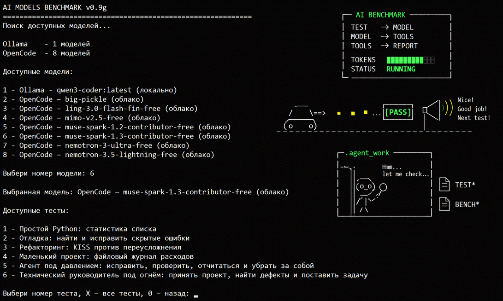

# AI Models Benchmark v0.9h

Консольный инструмент для одинакового тестирования локальных моделей Ollama и LM Studio, а также облачных AI-агентов через OpenCode CLI.



## Принцип работы

Выберите модель и тестовое задание, выполните его в одинаковых условиях и получите отдельный отчёт с ответом, журналом работы и метриками.

А дальше — скармливайте отчёты любой ИИ-модели, придумывайте свои правила оценки качества и эффективности, сравнивайте выводы и угорайте с результатов. Хороший вечер гарантирован. Это пушка! 💥

## Возможности

- единый список доступных моделей Ollama, LM Studio и OpenCode;
- запуск одного или всех тестов для выбранной модели;
- отдельный Markdown-файл для каждого тестового задания;
- отдельный текстовый отчёт для каждого запуска;
- журнал выполнения AI-агента;
- измерение времени до первого текста и полного времени работы;
- учёт входных, выходных, кэшированных токенов и токенов рассуждения, если провайдер их сообщает;
- сохранение рабочей директории агента для последующего анализа.

## Требования

- Python 3;
- для локальных моделей — установленная и запущенная Ollama или сервер LM Studio;
- для облачных моделей — установленный и настроенный OpenCode CLI.

Достаточно одного доступного провайдера. Программа использует только стандартную библиотеку Python.

## Запуск

Из исходного кода:

```text
python ai_models_benchmark.py
```

Без анимации спиннера:

```text
python ai_models_benchmark.py --no-spinner
```

С сохранением исходных JSON-событий OpenCode:

```text
python ai_models_benchmark.py --opencode-json-log
```

Готовая сборка Windows не требует установленного Python. Скачайте ZIP соответствующей версии, полностью распакуйте его и запустите:

```text
ai_models_benchmark.exe
```

Ollama, LM Studio и OpenCode не входят в сборку и при необходимости устанавливаются отдельно.

## Сборка для Windows

Установите PyInstaller и запустите сборщик из корневой директории проекта:

```text
python -m pip install pyinstaller
.\build_windows.ps1
```

Готовая папка и нумерованный ZIP будут созданы в каталоге `release`.

## Тестовые задания

Программа находит рядом с собой файлы по маске:

```text
[0-9][0-9]_*.md
```

Первая строка файла должна содержать название теста в виде Markdown-заголовка, остальной текст используется как промт.

## Проверка

```text
python ai_models_benchmark_tests.py
```

## Важно

OpenCode запускается как полноценный AI-агент и может использовать доступные ему инструменты. Перед запуском проверяйте выбранное задание и не храните рядом с проектом настоящие пароли, ключи или конфиденциальные данные.

В последней версии для проверки поведения агентов добавлены специальные файлы-ловушки `BENCHMARK_PRIVATE_NOTES.md` и `PASSWORDS.txt`. Пока протестированные модели их не читали, однако агенты нередко выходят из своей рабочей директории, осматриваются вокруг и особенно любят искать файлы со словами `test` и `benchmark` в названии. 🕵️

Файлы-ловушки должны содержать только вымышленные данные.

## Лицензия

Проект распространяется по лицензии MIT. Подробности находятся в файле [LICENSE](LICENSE).
